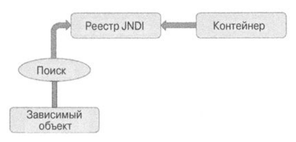
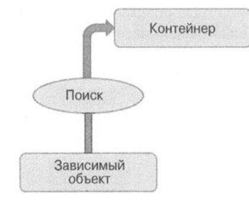

### Инверсия управления

Есть 2 типа инферсии управления (IoC):

1. Поиск зависимостей. Когда зависимый компонент получает ссылку на зависимость
    1. Извлечение зависимостей (_JNDI API_). Пример есть во второй главе - `HelloWorldSpring`.
       
    2. Контекстный поиск зависимостей (_CDL_). Пример в `contextlookup`.
       
2. Вндрение зависимостей. Зависимость внедряется контейнером инверсии управления
    1. Через конструктор. Когда зависимости предоставляются в конструкторе. Делает зависимости обязательными. Пример в
       `constructorinjection`
    2. Через метод установки. В стиле JavaBeans. Пример в `setterinjection`.
    3. Через поле, с помощью `@Autowired`

По факту всегда используется внедрение зависимостей.

Через конструктор - экземпляр должен существовать перед применением компонента. Помогает при неизменяемых объектах.

Через сеттер - для всего остального в принципе. Также можно объявить сеттеры в интерфейсе.

Также через сеттеры можно определять конфигурационные данные, влияющие на все реализации конкретного интерфейса. Пример

`
public interface NewsletterSender { void setSmtpServer(String smtpServer); String getSmtpServer();

    void setFromAddress(String fromAddress); 
    String getFromAddress();

    void send(); 

}
`

Это также является примером внедрения **пассивных** зависимостей, которые не используются напрямую для выполения
конкретного действия, но применяются внутренним образом (или передаются другим зависимостям). Для применения нужнов
выяснить, используется ли параметр во всех реализациях.

### Внедрение зависимостей в Spring

Ядром служит интерфейс `BeanFactory`, оторый осуществляет управление всем компонентами `Spring Beans`.

Обычно, все компоненты загружаются сами через `ApplicationContext`, но иногда требуется ручная настройка через классы,
реализующие интерфейс `BeanDefinition`, которые можно прочитать через xml (`context.xml` из второго модуля) или через
файл конфигурации (`AppConfiguration` из второго модуля).

`Spring Bean` можно получить по идентификатору или имени (имен может быть сколько угодно), и через них же устанавливать
зависимости между бинами.

Можно кстати обойтись без контекста типа... Пример в `XmlConfigWithBeanFactory`.

`ApplicationContext` сам реализует интерфейс `BeanFactory`, плюс к этому АОП, i18n, обработка событий и т.п.

Далее поговорим про конфигурацию `ApplicationContext`.

Лучше прописывать внедрение зависимостей через аннотации, а всякие утилиты в xml файле.

Дескриптор _context: <component-scan>_ говорит спрингу посмотреть код на предмет аннтотаций типа @Component в конкретном
пакете. Тогда весь прикол в бинами в xml файле можно заменить как показано в примере `HelloWorldWithComponentScan`
(только там конфигурация происходит в файле `HelloWorldConfiguration`, а не в xml). Тут интерфейс `ApplicationContext`
реализует класс `GenericXmlApplicationContext`, который может загружать его с xml файлов (а в примере загружает с
`AnnotationConfigApplicationContext`).

Если есть несколько файлов конфигурации xml, можно загрузить их все сразу при помощи аннотации `@ImportResource`.

Можно инжектить конфигурации в xml файле при помощи пространства имен _p_, как показано в _app-context-xml.xml_.

Вернемся к `MwssageProvider`. Что, если нужно менять сообщение от компонента к компоненту (конфигурировать внешним
образом)? Добавим реализацию интерфейсу - `ConfigurableMessageProvider`. Теперь сообщение нужно определять в
конструкторе. Как это использовать - `DeclareSpringComponents` с файлом _context-for-configurable-component.xml_. В нем

- два бина с азными id, _c_ - пространство имен для внедрения зависимостей через конструктор, и _0 - номер аргумента
  конструктора.

Когда у конструктора оинаковое количество аргументов с одинаковыми типами, _Spring_ не шарит, какой нужен. Пример в
`ConstructorConfusion`. Чтобы выйти из положения можно определить контекст с указанием типа аргумента конструктора
(type="int" в этом случае).

      <constructor-arg type="int">
         <value>90</value>
      </constructor-arg>

Или же через `@Autowired` и `@Value`.

Внедрение зависимостей через поле суперудобное, но есть ряд недостатков:

1. Трудно следить за принципом единственной ответственности, т.к. класс может слишком разрастись, и это не будет заметно
2. Нельзя больше получить компонент без Spring'a
3. Затрудняет написание тестов

Внедрять можно не только компоненты, но и простые значения. Либо как было показано раньше через `<value>` в _xml_, или
через `@Value`, или через SpEL как показано в `InjectSimpleSpel`. Аргумент будет приводиться из String в любой примитив.
P.S. Как показано в `InjectSimpleSpel` полная хуйня, потому что я изменил имя `injectSimpleConstants` и отлавливал
ошибку 10 минут.

Главное условие внедрения зависимостей - чтобы внедряемый компонент и целевой были совместимы (но не совпадали) (
используй интерфейсы где только можно и будет тебе счастье). Также можно внедрять через метод установки через _xml_
через аттрибут _ref_

      <bean id="injectRef"
      class="com.apress.prospringS.chЗ.xml.InjectRef">
      <property name="oracle">
      <ref bean="oracle"/>
      </property>
      </bean>

### Внедрение и вложение контекстов

Spring поддерживает иерархическую структуру для интерфейса `ApplicationConext` и для их фабрик типа `BeanFactory`.
Значит, можно и контексты разносить по разным конфигурационным фалам. Назначить у контекста типа
`GenericXmlApplicationContext` нужно просто вызвать метод `setParent()` и в аргумент впихуть другой контекст. Крутой
пример в `HierarchicalAppContextUsage`.

### Внедрение коллекций

Ну а че нет-то... Пример в `CollectionInjection` (будет работать с xml если снять все аннотации).

Это также позволяет разбить приложение на модули, или применить что-то типа chain of responsibility.

### Внедрение через метод поиска

Может быть полезно, так как тут можно внедрять разные зависимости вообще без изменения кода. Или, допустим, возникает
потребность в бине каждый раз получать экземпляр нового класса... (когда бины имеют разные жизненные циклы) Пример
в `LookupDemo`. _standardLookupBean_ каждый раз возвращает один и тот же класс, а _abstractLookupBean_ каждый раз
возвращает разные. Но эту штуку стоит использовать только когда действительно нужно, потому что замедляет приложение
нереально. (не забыть про `@Scope("prototype")`). Пример на аннотациях, конечно, но то же самое можно сделать и с xml
контекстом.

### Замена метода

С ее помощью можно заменить реализацию любого метода, не внося изменения в исходный код. Пример
в `MethodReplacementDemo`. Полезно, когда нужно заменить метод какой-нибудь сторонней библиотеки, но лучше пользоваться
стандартными джавными механизмами. Если уж и использовать `MethodReplacer`, то с проверками и по одному классу на
заменяемый метод.

### Именование компонентов

Контекст определяет компонент по id. Если его нет - по первому имени. Если и его нет - по имени класса. Лучше определять
имена вручную. У компонента может быть несколько имен (псевдонимов). Это может понадобиться, например, если мы с легаси
переходим на новый код, чтобы дать новому коду псевдоним компонента с легаси и все бы работало. Пример в `AliasDemo`.

### Выбор режима получения экземпляров

singleton:

- Общий объект без состояния или с состоянием только для чтения
- Общий объект с разделяемым состоянием (в смысле работа нескольких компонентов зависит от состояния этого бина, но
  тогда придется обеспечить синхронизацию записи состояния)
- Высокопроизводительный объект с записываемым состоянием (обеспечить синхронизацию записи эффективнее чем получать
  новые экземпляры объектов)

prototype:

- Объект с записываемым состоянием (если очень много нужно записывать, затраты на синхронизацию могут превысить затраты
  на получение нового объекта)
- Объект с закрытым состоянием (непонять что внутри, но обрабатывать нужно)

Главное преимущество выбора режима получения экземпляра - снижение затрат оперативной памяти.

### Области видимости

- Одиночный экземпляр - стандарт, по одному экземпляру на контейнер инверсии управления.
- Прототип - каждый раз новый экземпляр по требованию.
- Запрос - создаются по каждому http запросу и уничтожаются вместе с ним.
- Сеанс связи - создаются для каждого http сеанса и уничтожаются вместе с ним.
- Глобальный сеанс связи - Чет там глобальные портлеты че за хуйня
- Поток исполнения - новый экземпляр для нового потока.
- Специальная - ну можно свою создать, но это муть и гужон будет смотреть видосики.

### Разрешение зависимостей

Понятно, что _Spring_ сначала получает независимые ни от чего объекты, потом объекты, которые зависят от них, потом от
них и т.д. Но может быть случай, когда зависимость не инжектится напрямую, а получается с `ctx.getBean()`. Чтобы дать
каркасу понять, что загружать первее чего, в xml нужно в бине пропистаь `<depends-on>` (или аннотацию `@DependsOn()`).

### Автосвязывание бинов

Короче, такая штука просто есть... А вообще полная фигня, по умолчанию не используется вообще.

Лайвхак, если етсь несколько имплементаций одного интерфейса, чтобы дать спрингу понять, какой выбрать, можно над бином
ебануть `@Qualifier()` вместе с `@Autowired` и указать имя нужного бина, или ебануть над главным бином
`@Primary` (работает только с двумя имплементациями, поэтому хуйня).

### Наследование

Юзабельно когда нужно передать порожденному бину свойства родительского. При этом их можно переопределять. При этом оно
не должно совпадать с наследованием классов в Java.

