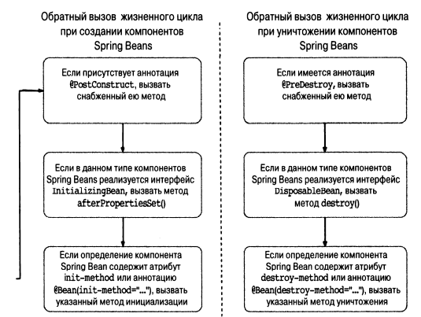

### Жизненный цикл бинов

Разбираться в этом нужно для одной вещи - чтобы делать что-то при инициализацией и при уничтожения бина (при 
уничтожении прототипных бинов нельзя ничего сконфигурить (но это неточно)).

Делается это при помощи интерфейсов, методов и аннотаций.

Интерфейс - имплементируй метод (только если есть очень много бинов)

Метод - запихни его в ApplicationContext (заебешься в контекст писать методы)

Аннотации - тоже метод указывается (то, что нужно)

Spring не позволяет вмешиваться в процедуру разрешения зависимостей. 

Жизненный цикл Бинов

### Выполнение метода при создании компонента

Можно установить дефолтный метод, который будет вызываться при каждом создании бина `default-init-rnethod="название
метода"` (метод не может принимать аргументы). Это отличный способ обеспечить правильность конфигурирования компонентов.

Пример в SingerConfigDemo

### Реализация интерфейса InitializingBean

Можно имплементировать в бин, чтобы выполнить код после конфигурирования.

### Применение аннотации @PostConstruct по спецификации ]SR-250 

