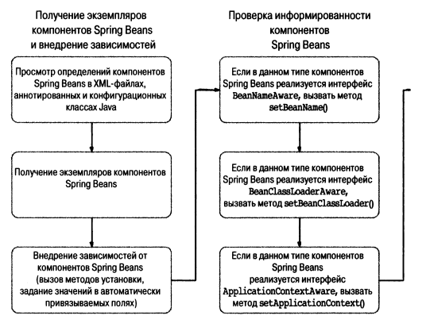

# Жизненный цикл бинов

Разбираться в этом нужно для одной вещи - чтобы делать что-то при инициализацией и при уничтожения бина (при уничтожении
прототипных бинов нельзя ничего сконфигурить (но это неточно)).

Делается это при помощи интерфейсов, методов и аннотаций.

Интерфейс - имплементируй метод (только если есть очень много бинов)

Метод - запихни его в ApplicationContext (заебешься в контекст писать методы)

Аннотации - тоже метод указывается (то, что нужно)

Spring не позволяет вмешиваться в процедуру разрешения зависимостей.

Жизненный цикл Бинов

## Выполнение метода при создании компонента

Можно установить дефолтный метод, который будет вызываться при каждом создании
бина `default-init-rnethod="название метода"` (метод не может принимать аргументы). Это отличный способ обеспечить
правильность конфигурирования компонентов.

Пример в `SingerConfigDemo`.

### Реализация интерфейса `InitializingBean`

Можно имплементировать в бин, чтобы выполнить код после конфигурирования. Предпочтительно использовать именно этот
метод.

Пример в `SingerWithInterface`, но не через контекст в xml файле, а через аннотации `@Bean`.

### Применение аннотации `@PostConstruct` по спецификации JSR-250

То же самое, что и раньше, но теперь с аннотацией.

Пример в `SingerWithAnnotation`.

Все три метода можно использовать одновременно. Тогда порядок применения: @PostConstruct -> afterPropertiesSet -> метод
из контекста.

## Выполнение метода при уничтожении компонента

Частенько применяется, чтобы уничтожить ресурс, который был сконфигурирован в методе инициализации.

Аналогично в контексте в аттрибуте _destroy-method_, или через интерфейс `DisposableBean`, или через аннотацию `
@PreDestroy`.

Порядок вызова: `@PreDestroy` -> `destroy()` -> метод сконфигурированный в _xml_.

Но этот метод не вызывается автоматически!!! Нужно либо вызвать метод `close()` у контекста, но это сложно, так как у
программы может быть несколько точек выхода, либо применить перехватчик завершения, вызвав в мейне
`ctx.registerShutdownHook()`, как показано в примере `DestructiveBeanWithAnnotation`.

