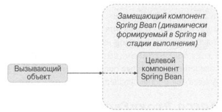
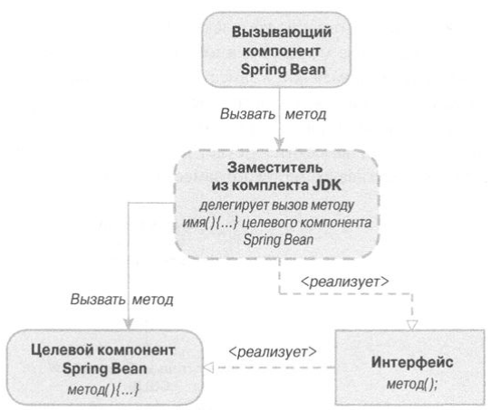
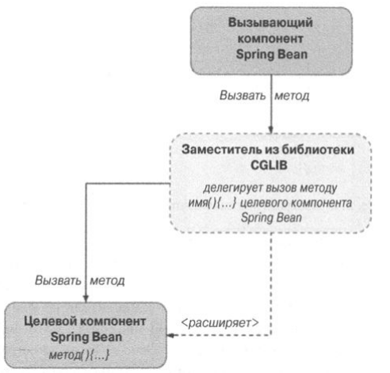

# АОП

Используется, когда необходимо реализовать
сквозной функционал для большого блока кода, если его нельзя или 
нецелесообразно вынести в класс или функцию. 

Пример - логгирование или сесурити.

АОП бывает статическое (AspectJ - связывание во время компиляции и 
все) и динамическое (Spring AOP - изменение конфигов АОП во время
выполнения).

Выбирать AspectJ можно ради его функционала и для 
производительности, а Spring - тоже для функционала короче и всего 
остального.

## АОП в Spring

Основная фишка - использование заместителей типа ProxyFactory
для получения класса с "советом" - чисто программный подход.

С бинами каркас Spring сам формирует замещающие бины. 

Spring поддерживает только одну точку соединения - вызов
функции.

Советы: 6 видов

Предшествующий - до вызова метода (может читать и изменять
аргументы)

Послевозвратный - после вызова метода (может читать аргументы и
возвращаемое значение)

Полседующий - как послевозвратный, но вызовется в любом случае,
даже если метод выкинет исключение

Окружающий - до и после метода, причем можно контролировать,
нужно ли вызвать метод вообще, или заменить его собственным

Перехватывающий - как послевозвратный, но только если было 
вызвано исключение (может читать исключение и аргументы)

Введение - указывает реализацию методов, вводимых по совету

## Советники и срезы в Spring

Для создания срезов нужно использовать (реализовать) классы интерфейса
Pointcut. Доступные реализации:
- Объединение срезов
- обработка срезов потока управления
- Сопоставление по имени
- Определение срезов с помощью регулярных выражений
- Определение срезов с помощью выражение AspectJ
- Определение срезов, обнаруживающих аннотации на уровне классов или 
методов

В Spring также есть статические(например, на имя метода) и 
динамические(например, на конкретное значение аргумента) срезы. 
Статические проверки приоритетнее динамических, поэтому в целях
улучшения производительности, необходимо их реализовывать.

Иногда удобнее воспользоваться созданием срезов на AspectJ.

## Заместители JDK и CGLIB

Если используются заместители из комплекта JDK - каждый 
класс должен реализовывать интерфейс.

Если из CGLIB - создается байткод класса для каждого заместителя.

Кстати, пример составного среза в 5.AOP/src/main/java/example/composable.

## Введения

Введение - особый тип окружающего совета, который внедряет в класс новые
реализации интерфейсов. Это самые эффективные средства АОП, позволяющие 
менять реализации объектов динамически. 

Пример в 5.AOP/src/main/java/example/introduction.

## Декларативненько

В Spring также есть декларативный подход к АОП. 
Можно делать это через xml конфиги, но поскольку я их ненавижу, 
оставлю только подход с аннотациями в стиле @AspectJ.

Пример в 5.AOP/src/main/java/example/annotations.

