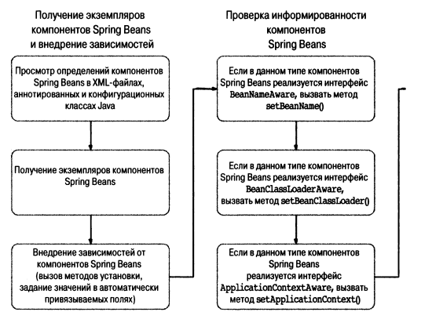
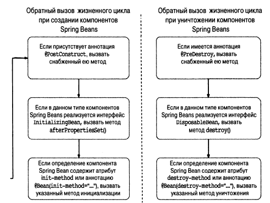

### Жизненный цикл бинов

Разбираться в этом нужно для одной вещи - чтобы делать что-то при инициализацией и при уничтожения бина (при 
уничтожении прототипных бинов нельзя ничего сконфигурить (но это неточно)).

Делается это при помощи интерфейсов, методов и аннотаций.

Интерфейс - имплементируй метод (только если есть очень много бинов)

Метод - запихни его в ApplicationContext (заебешься в контекст писать методы)

Аннотации - тоже метод указывается (то, что нужно)

Spring не позволяет вмешиваться в процедуру разрешения зависимостей. 

Жизненный цикл Бинов

### Выполнение метода ри создании компонента

Пример в SingerConfigDemo